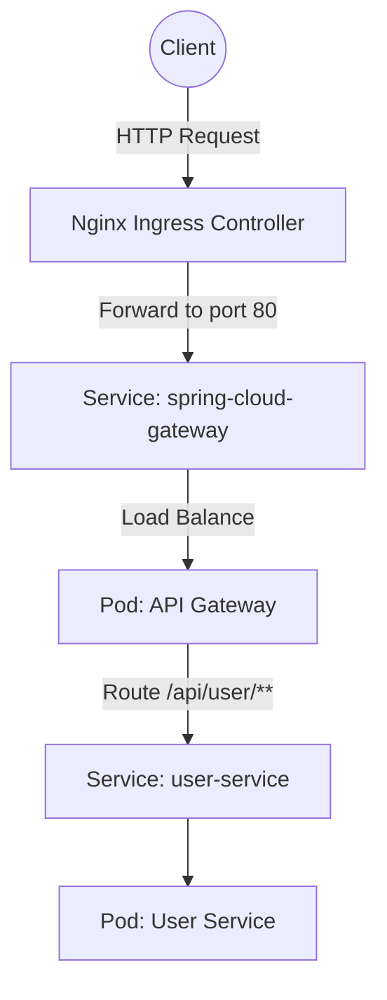

# Tài liệu Kiến trúc Routing: Ingress và API Gateway

Tài liệu này mô tả cách luồng dữ liệu (traffic) đi từ bên ngoài vào hệ thống các microservices thông qua Kubernetes Ingress và Spring Cloud Gateway.

## Tổng quan Kiến trúc

Hệ thống sử dụng mô hình hai lớp (two-tier routing) để xử lý request:
1. **Lớp 1 - Nginx Ingress**: Đóng vai trò là cổng giao tiếp với bên ngoài (Edge Gateway), nhận request từ Internet và chuyển hướng vào bên trong cụm Kubernetes.
2. **Lớp 2 - Spring Cloud Gateway**: Đóng vai trò là cổng API (API Gateway), thực hiện các logic định tuyến linh hoạt (routing), bảo mật, rate limiting ở cấp độ ứng dụng trước khi đẩy request tới các service backend (ví dụ: `user-service`).



## Chi tiết Cấu hình

### 1. Kubernetes Ingress (`infra/ingress.yaml`)

Ingress được cấu hình bằng Nginx Ingress Controller (`ingressClassName: nginx`).

- **Nhiệm vụ**: Chặn các request HTTP ở mức cluster edge.
- **Routing Rules**: Tất cả request (`path: /`, `pathType: Prefix`) đều được đẩy thẳng tới service có tên là `spring-cloud-gateway` trên cổng `80`.
- **Cấu hình Timeout**: Ingress được cấu hình proxy read/send timeout là `3600` giây thông qua annotations để hỗ trợ các kết nối dài (như WebSocket, Long Polling nếu cần).

### 2. Spring Cloud Gateway (`api-gateway/`)

Ứng dụng Spring Boot đóng vai trò là API Gateway chạy trên cổng `8080`.

- **Kubernetes Service**: Service `spring-cloud-gateway` (`infra/gateway-deployment.yaml`) map cổng `80` của cụm với cổng `8080` của container Gateway.
- **Application Config** (`api-gateway/src/main/resources/application.yml`):
  Sử dụng Spring Cloud Gateway để khai báo các `routes` tĩnh trỏ tới backend.
  
  *Ví dụ:*
  ```yaml
  spring:
    cloud:
      gateway:
        routes:
          - id: user-service-route
            uri: http://user-service:80
            predicates:
              - Path=/api/user/**
  ```
  - **Predicates**: Điều kiện khớp. Bất kỳ request nào bắt đầu bằng `/api/user/` sẽ khớp với route này.
  - **URI**: Đích đến của request. Hệ thống sử dụng trực tiếp Kubernetes Service DNS (`http://user-service:80`) thay vì Eureka Discovery. K8s sẽ tự động cân bằng tải đến các pod của `user-service`.

## Mở rộng Routing

Khi có thêm microservice mới (ví dụ: `product-service`), quy trình khai báo sẽ như sau:
1. Tạo K8s Service cho service mới (vd: `product-service`).
2. Mở file `api-gateway/src/main/resources/application.yml`.
3. Thêm một block cấu hình mới dưới danh sách `routes`:
   ```yaml
   - id: product-service-route
     uri: http://product-service:80
     predicates:
       - Path=/api/product/**
   ```
4. Build lại Docker image của API Gateway và deploy lại lên Kubernetes.

## Hướng dẫn Triển khai

Để đưa những cấu hình này lên hoạt động thực tế trên Kubernetes, hãy thực hiện tuần tự theo các bước dưới đây:

### Bước 1: Build mã nguồn (tại máy local / server CI/CD)
Bạn cần biên dịch API Gateway thành file `.jar`:
```bash
cd api-gateway
./mvnw clean package -DskipTests
```

### Bước 2: Build Docker Image
Đóng gói API Gateway thành một image để Kubernetes có thể chạy:
```bash
# Đứng tại thư mục gốc của api-gateway
docker build -t gateway-service:latest .
```
*(Lưu ý: Nếu bạn dùng môi trường cụm Kubernetes thật thay vì Minikube/Docker Desktop, bạn cần push image này lên một Container Registry như Docker Hub/Harbor và cập nhật lại tag `gateway-service:latest` trong `infra/gateway-deployment.yaml`)*.

### Bước 3: Deploy hạ tầng lên Kubernetes
Sử dụng công cụ `kubectl` để áp dụng toàn bộ các file định nghĩa trong thư mục `infra/`:
```bash
# Trở lại thư mục gốc của dự án
cd ..
kubectl apply -f infra/
```

### Bước 4: Kiểm tra trạng thái
Đảm bảo tất cả các Pods và Services đã chạy ổn định:
```bash
# Kiểm tra Pods
kubectl get pods -l app=spring-cloud-gateway

# Kiểm tra Services và Ingress
kubectl get svc spring-cloud-gateway
kubectl get ingress edge-ingress
```

### Bước 5: Kiểm thử Route
Khi các hệ thống đã Ready, bạn có thể kiểm tra xem Ingress và Gateway có đang thực hiện route chính xác hay không bằng lệnh (giả sử ingress được trỏ vào `localhost` hoặc tên miền cụ thể):
```bash
curl -v http://localhost/api/user/health
```
Nếu cấu hình đúng, request sẽ đi qua Ingress -> Gateway (8080) -> `user-service` (80) và trả về kết quả từ `user-service`.
